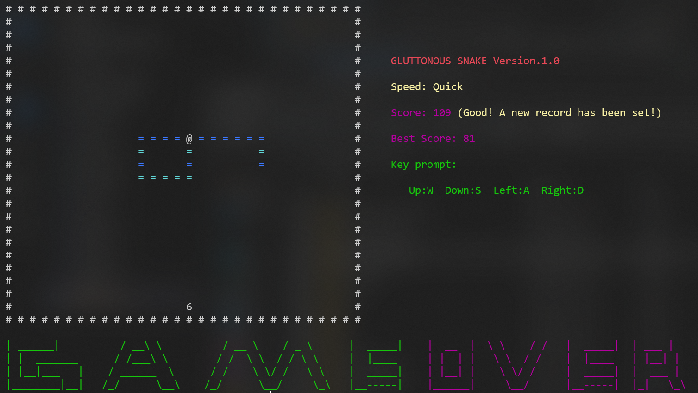

# classicCppCases
一些经典的c++项目或案例的学习

## [案例一: 贪吃蛇]("https://github.com/SAI-h/classicCppCases/tree/main/GluttonousSnake")
### 编译方式
``` shell
g++ demo.cpp snake.cpp graph.cpp brush.cpp food.cpp -o demo
```
### 项目运行
``` shell
./demo
```
### 游戏规则
控制蛇的运动方向，使其可以吃到相应分值的食物；随着获得的总分越高，蛇的运动速度也会越快，玩家需要保证蛇头不碰到周围墙壁和自己身体的情况下，获取尽可能高的分数。
