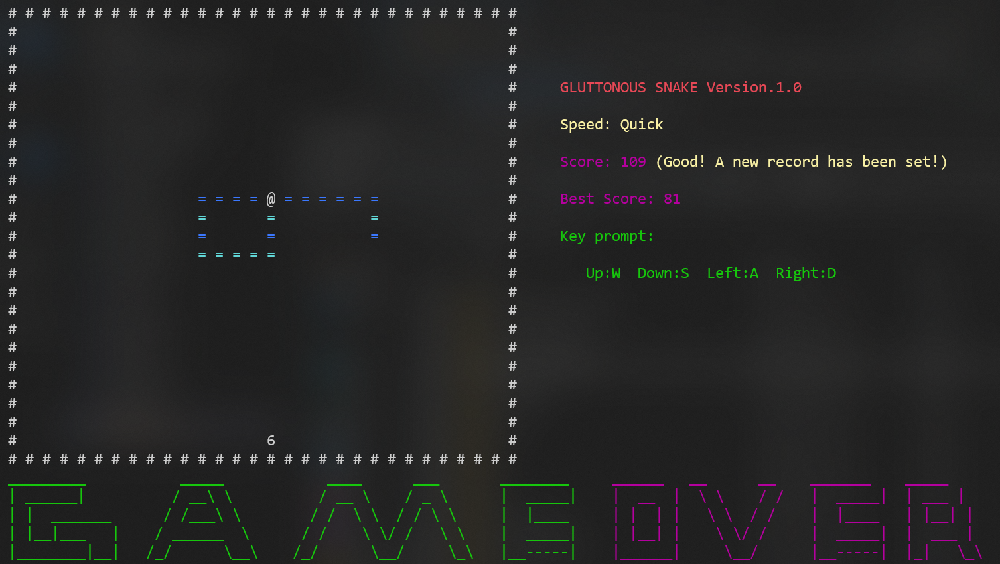

# classicCppCases
一些经典的c++项目或案例的学习

## 案例一: 贪吃蛇(GluttonousSnake)
#### 运行环境：windows
### 编译方式
```shell
g++ demo.cpp snake.cpp graph.cpp brush.cpp food.cpp -o demo
```
### 项目运行
```shell
./demo
```
### 游戏规则
控制蛇的运动方向，使其可以吃到相应分值的食物；随着获得的总分越高，蛇的运动速度也会越快，玩家需要保证蛇头不碰到周围墙壁和自己身体的情况下，获取尽可能高的分数。


## 案例二： 聊天室(ChatRoom)
#### 运行环境：linux
### 编译方式
``` shell
# 服务器端编译（控制台输入下述内容）
g++ chatServer/chatServer.cpp chatServer/serverDemo.cpp netUnity/netUnity.cpp tool/tool.cpp -o server -lpthread

# 客户端编译（控制台输入下述内容）
g++ chatClint/chatClint.cpp chatClint/clintDemo.cpp netUnity/netUnity.cpp tool/tool.cpp -o client -lpthread
```
或者使用make执行Makefile脚本进行编译。
### 项目运行
```shell
# 服务器运行
./server

# 客户端运行用户名为UsrName的账号
./client [UsrName] [Password]

# 客户端注册用户名为UsrName的账号
./client signIn [UsrName]
```
### 演示示例
``` shell
# 服务器端
saih@saih:~/workplace/chatRoom$ ./server ??
Usage-Enable default port: ./server
saih@saih:~/workplace/chatRoom$ ./server
Server is running...
User[4] connected...
User[5] connected...
User[6] connected...
User[5] is sending...
User[4] is sending...
User[6] is sending...
User[4] is sending...
User[6] is sending...
```
``` shell
# 客户端 nobody
saih@saih:~/workplace/chatRoom$ ./client ??
If you do not have an account, please register first: ./client signIn [UserName]
If you want to log in to this chat room, please provide your account number and password: ./client [UserName] [Password]
saih@saih:~/workplace/chatRoom$ ./client signIn admin
Sorry, the current user name has already been registered!
saih@saih:~/workplace/chatRoom$ ./client signIn nobody
Registered successfully! Your login password is QhgjaHnv0P07XJ7v
Please keep the password information safe!
saih@saih:~/workplace/chatRoom$ ./client nobody QhgjaHnv0P07XJ7u
Sorry, the password is incorrect!
saih@saih:~/workplace/chatRoom$ ./client nobody QhgjaHnv0P07XJ7v
Hello User[4], welcome to our chatroom!
If you want to log out, please input "quit()"!

[Usr]admin: Hello 😀
[Self]nobody: wow 😈 ni hao
[Usr]www: 天真热啊
[Self]nobody: bye bye
[Self]nobody: quit()
Bye~
```
``` shell
# 客户端 admin
saih@saih:~/workplace/chatRoom$ ./client admin TmIk9ibRLCNgrV1+
Hello User[5], welcome to our chatroom!
If you want to log out, please input "quit()"!

[Self]admin: Hello 😀
[Usr]nobody: wow 😈 ni hao
[Usr]www: 天真热啊
[Usr]nobody: bye bye
[Usr]www: enen
[Self]admin:
```
``` shell
# 客户端 www
saih@saih:~/workplace/chatRoom$ ./client www J6hw}#]Z^yH9r%2!
Hello User[6], welcome to our chatroom!
If you want to log out, please input "quit()"!

[Usr]admin: Hello 😀
[Usr]nobody: wow 😈 ni hao
[Self]www: 天真热啊
[Usr]nobody: bye bye
[Self]www: enen
[Self]www:
```
